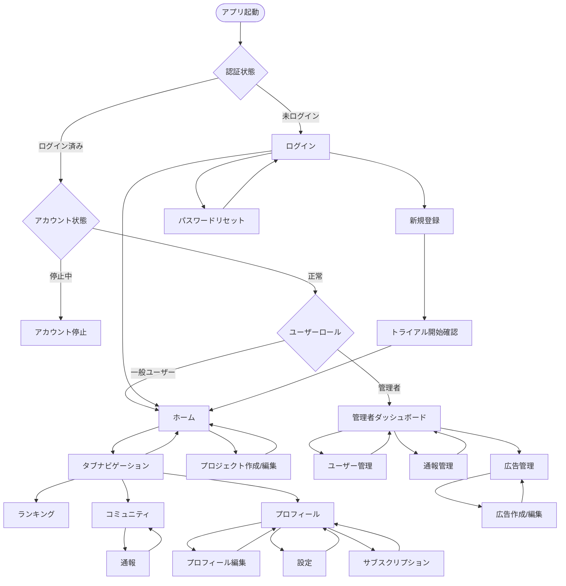
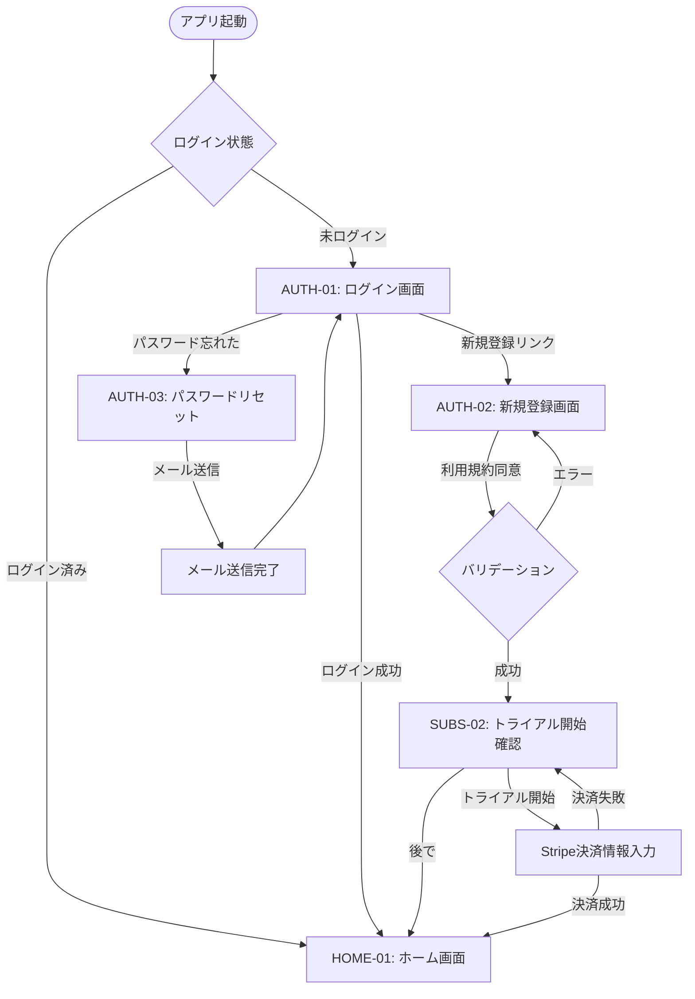
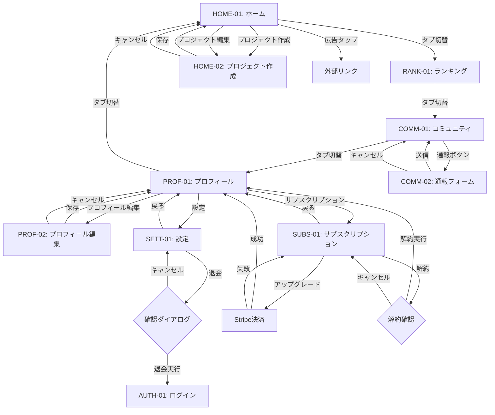
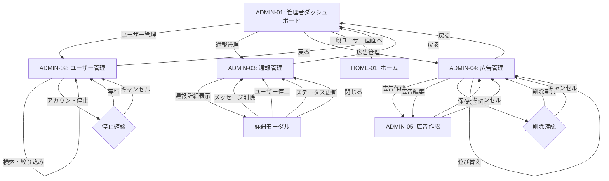

# **TSUZUKU 画面遷移図**

- 作成日: 2025-11-05
- バージョン: 2.0.0
- 作成者: Codex

---

## **目次**

1. [画面一覧](#画面一覧)
2. [画面遷移図（全体）](#画面遷移図全体)
3. [画面遷移図（認証フロー）](#画面遷移図認証フロー)
4. [画面遷移図（メインアプリ）](#画面遷移図メインアプリ)
5. [画面遷移図（管理者）](#画面遷移図管理者)
6. [画面詳細仕様](#画面詳細仕様)

---

## **画面一覧**

### **一般ユーザー画面**

| 画面ID | 画面名 | 説明 |
| --- | --- | --- |
| AUTH-01 | ログイン | メールアドレス・パスワードでログイン |
| AUTH-02 | 新規登録 | アカウント作成 |
| AUTH-03 | パスワードリセット | パスワード再設定メール送信 |
| HOME-01 | ホーム | 学習管理のメイン画面 |
| HOME-02 | プロジェクト作成/編集 | プロジェクト情報の入力 |
| RANK-01 | ランキング | 月間・年間ランキング表示 |
| COMM-01 | コミュニティ | オープンチャット |
| COMM-02 | 通報 | メッセージ通報フォーム |
| PROF-01 | プロフィール | ユーザープロフィールと学習データ |
| PROF-02 | プロフィール編集 | ニックネーム、アバター、自己紹介の編集 |
| SETT-01 | 設定 | 各種設定画面 |
| SUBS-01 | サブスクリプション | プラン選択・課金画面 |
| SUBS-02 | トライアル開始 | トライアル開始の確認 |
| ERR-01 | アカウント停止 | アカウント停止通知画面 |

### **管理者画面**

| 画面ID | 画面名 | 説明 |
| --- | --- | --- |
| ADMIN-01 | 管理者ダッシュボード | 管理機能へのナビゲーション |
| ADMIN-02 | ユーザー管理 | ユーザー一覧・検索・停止 |
| ADMIN-03 | 通報管理 | 通報一覧・対応 |
| ADMIN-04 | 広告管理 | 広告一覧・作成・編集 |
| ADMIN-05 | 広告作成/編集 | 広告詳細入力フォーム |

---

## **画面遷移図（全体）**

---

## **画面遷移図（認証フロー）**

**フロー説明**:
1. アプリ起動時にログイン状態をチェック
2. 未ログインの場合、ログイン画面を表示
3. 新規登録時、利用規約同意とバリデーション後、トライアル開始確認画面へ
4. トライアルを開始する場合、Stripe決済情報を入力（自動課金設定）
5. トライアルを開始しない場合、Freeプランでホーム画面へ

---

## **画面遷移図（メインアプリ）**

**タブナビゲーション**:
- ホーム、ランキング、コミュニティ、プロフィールの4つのタブ
- どのタブからでも他のタブへ直接遷移可能

**Pro限定機能の制御**:
- プロジェクト作成時、Freeプランで既に1プロジェクト存在する場合、アップグレード促進ダイアログを表示
- プロフィールの詳細グラフ表示時、Freeプランの場合、Pro限定マークを表示しアップグレード促進

---

## **画面遷移図（管理者）**

**管理者画面アクセス**:
- 管理者権限を持つユーザーのみアクセス可能
- 一般ユーザー画面へも切り替え可能（テスト用）

---

## **画面詳細仕様**

### **AUTH-01: ログイン画面**

**表示要素**:
- アプリロゴ
- メールアドレス入力フィールド
- パスワード入力フィールド
- ログインボタン
- 「パスワードを忘れた方」リンク
- 「新規登録はこちら」リンク

**バリデーション**:
- メールアドレス形式チェック
- パスワード未入力チェック

**遷移先**:
- ログイン成功 → HOME-01（一般ユーザー）/ ADMIN-01（管理者）
- 新規登録リンク → AUTH-02
- パスワードを忘れた → AUTH-03

---

### **AUTH-02: 新規登録画面**

**表示要素**:
- メールアドレス入力
- パスワード入力（8文字以上）
- パスワード確認入力
- ニックネーム入力
- 利用規約同意チェックボックス
- 登録ボタン
- 「ログインはこちら」リンク

**バリデーション**:
- メールアドレス形式チェック、重複チェック
- パスワード8文字以上、確認入力一致チェック
- ニックネーム重複チェック
- 利用規約同意必須

**遷移先**:
- 登録成功 → SUBS-02（トライアル開始確認）

---

### **AUTH-03: パスワードリセット画面**

**表示要素**:
- メールアドレス入力
- 送信ボタン
- 説明文「入力されたメールアドレスにパスワード再設定用のリンクを送信します」

**遷移先**:
- 送信完了 → メール送信完了メッセージ表示 → AUTH-01

---

### **HOME-01: ホーム画面**

**表示要素**:
- **広告/お知らせエリア**（画面上部）:
  - 管理者が作成した広告を自動スクロール表示
  - タップでリンク先に遷移
- **現在学習中ユーザー数**:
  - 「現在○○人が学習中」表示（リアルタイム）
- **学習セッション管理**:
  - 学習開始/終了ボタン（トグル）
  - タイマー表示（学習中の場合）
  - 学習終了時にページ数入力ダイアログ表示
- **ストリーク表示**:
  - 「連続○日」表示
- **プロジェクトカード**（複数表示）:
  - プロジェクト名
  - 完了ページ数 / 総ページ数
  - 達成率（プログレスバー）
  - 編集ボタン
- **プロジェクト追加ボタン**:
  - Freeプランで既に1プロジェクト存在する場合、タップでアップグレード促進ダイアログ表示
  - Proプランの場合、タップで HOME-02 へ遷移

**遷移先**:
- プロジェクト追加 → HOME-02
- プロジェクト編集 → HOME-02
- 広告タップ → 外部リンク
- タブ切替 → RANK-01 / COMM-01 / PROF-01

---

### **HOME-02: プロジェクト作成/編集画面**

**表示要素**:
- プロジェクト名入力
- 総ページ数入力（編集時は変更不可、グレーアウト）
- 開始日選択（カレンダー）
- 終了予定日選択（カレンダー）
- 学習曜日選択（月〜日の複数選択）
- 起床時間選択（時刻ピッカー）
- 保存ボタン
- キャンセルボタン
- 削除ボタン（編集時のみ表示）
- アーカイブボタン（編集時のみ表示）

**バリデーション**:
- 全フィールド必須
- 総ページ数は正の整数
- 開始日 < 終了予定日

**遷移先**:
- 保存/キャンセル → HOME-01

---

### **RANK-01: ランキング画面**

**表示要素**:
- **期間切り替えタブ**:
  - 月間ランキング / 年間ランキング（Phase2）
- **月切り替え**:
  - 「今月」/「先月」タブ
- **ランキングリスト**（TOP20）:
  - 順位
  - アバター
  - ニックネーム
  - ポイント
  - 自分の行は背景色で強調
- **自分の順位表示**（TOP20圏外の場合）:
  - 「あなたの順位: 圏外」

**遷移先**:
- タブ切替 → HOME-01 / COMM-01 / PROF-01

---

### **COMM-01: コミュニティ画面**

**表示要素**:
- **メッセージ一覧**（時系列、直近100件）:
  - アバター
  - ニックネーム
  - 投稿時刻
  - メッセージ本文（最大400文字）
  - 通報ボタン
- **「過去のメッセージを読み込む」ボタン**（100件以上の場合表示）
- **メッセージ入力フォーム**:
  - テキスト入力（最大400文字）
  - 文字数カウンター
  - 送信ボタン

**遷移先**:
- 通報ボタン → COMM-02
- タブ切替 → HOME-01 / RANK-01 / PROF-01

---

### **COMM-02: 通報フォーム**

**表示要素**:
- 対象メッセージの表示
- 通報理由入力（テキストエリア）
- 送信ボタン
- キャンセルボタン

**遷移先**:
- 送信/キャンセル → COMM-01

---

### **PROF-01: プロフィール画面**

**表示要素**:
- **プロフィール情報**:
  - アバター（タップで編集）
  - ニックネーム
  - 自己紹介
  - プロフィール編集ボタン
- **学習データ**:
  - 現在のストリーク（連続○日）
  - 累計学習時間
  - 起床カレンダー（直近1ヶ月、学習日のみ表示）
  - 当日の学習記録（開始時刻、学習時間）
- **詳細グラフ**（Pro限定、Freeの場合はロックアイコン表示）:
  - 毎日の起床時間推移グラフ
  - 累計学習時間の詳細グラフ
- **設定ボタン**
- **サブスクリプションボタン**

**遷移先**:
- プロフィール編集 → PROF-02
- 設定 → SETT-01
- サブスクリプション → SUBS-01
- タブ切替 → HOME-01 / RANK-01 / COMM-01

---

### **PROF-02: プロフィール編集画面**

**表示要素**:
- アバター画像選択（カメラ/ギャラリー）
- ニックネーム入力
- 自己紹介入力（最大200文字）
- 保存ボタン
- キャンセルボタン

**バリデーション**:
- ニックネーム重複チェック
- 画像サイズ上限（2MB）

**遷移先**:
- 保存/キャンセル → PROF-01

---

### **SETT-01: 設定画面**

**表示要素**:
- テーマ選択（ライト/ダーク）
- プライバシー設定:
  - プロフィール公開
  - ランキング表示
- お問い合わせリンク
- 利用規約リンク
- プライバシーポリシーリンク
- 退会ボタン

**遷移先**:
- 退会 → 確認ダイアログ → AUTH-01
- 戻る → PROF-01

---

### **SUBS-01: サブスクリプション画面**

**表示要素**:
- **現在のプラン表示**:
  - Free / Trial / Pro
  - トライアル期間中の場合、残り日数表示
- **プラン比較表**:
  - Free vs Pro 機能一覧
- **FAQ**:
  - よくある質問
- **アクション**:
  - Freeの場合: 「トライアルを開始」ボタン、「Proにアップグレード」ボタン
  - Trialの場合: 「Proに切り替える」ボタン、「トライアルをキャンセル」ボタン
  - Proの場合: 「解約する」ボタン

**遷移先**:
- アップグレード/トライアル開始 → Stripe決済画面 → PROF-01
- 解約 → 確認ダイアログ → PROF-01
- 戻る → PROF-01

---

### **SUBS-02: トライアル開始確認画面**

**表示要素**:
- トライアルの説明
  - 「1ヶ月間無料でProの全機能が使えます」
  - 「トライアル終了後は自動的に月額課金が開始されます」
  - 「いつでもキャンセル可能です」
- 「トライアルを開始する」ボタン
- 「後で」ボタン

**遷移先**:
- トライアル開始 → Stripe決済情報入力 → HOME-01
- 後で → HOME-01（Freeプラン）

---

### **ERR-01: アカウント停止画面**

**表示要素**:
- 「アカウントが停止されています」メッセージ
- 停止理由（管理者が設定した場合）
- お問い合わせリンク
- ログアウトボタン

**遷移先**:
- ログアウト → AUTH-01

---

### **ADMIN-01: 管理者ダッシュボード**

**表示要素**:
- メニューリスト:
  - ユーザー管理
  - 通報管理
  - 広告管理
- 「一般ユーザー画面へ」ボタン

**遷移先**:
- ユーザー管理 → ADMIN-02
- 通報管理 → ADMIN-03
- 広告管理 → ADMIN-04
- 一般ユーザー画面へ → HOME-01

---

### **ADMIN-02: ユーザー管理画面**

**表示要素**:
- 検索バー（ニックネーム、メールアドレス）
- 絞り込みフィルター（プランタイプ、アカウント状態）
- ユーザー一覧テーブル:
  - ニックネーム
  - メールアドレス
  - プラン（Free/Trial/Pro）
  - 登録日時
  - 最終ログイン
  - アカウント状態（正常/停止中）
  - アクションボタン（停止/停止解除）

**遷移先**:
- アカウント停止 → 確認ダイアログ → ADMIN-02
- 戻る → ADMIN-01

---

### **ADMIN-03: 通報管理画面**

**表示要素**:
- ステータスフィルター（pending / reviewed / resolved）
- 通報一覧テーブル:
  - 通報日時
  - 通報者ニックネーム
  - 被通報者ニックネーム
  - メッセージ抜粋
  - ステータス
  - 詳細ボタン
- **詳細モーダル**:
  - 通報理由
  - メッセージ全文
  - 通報者・被通報者情報
  - アクションボタン:
    - メッセージ削除
    - ユーザー停止
    - ステータス変更（reviewed / resolved）
  - 管理者メモ入力

**遷移先**:
- 戻る → ADMIN-01

---

### **ADMIN-04: 広告管理画面**

**表示要素**:
- 「新規作成」ボタン
- 広告一覧テーブル:
  - サムネイル
  - タイトル
  - 表示順
  - 有効/無効
  - 表示期間
  - アクションボタン（編集/削除/並び替え）
- ドラッグ&ドロップで並び替え機能

**遷移先**:
- 新規作成 → ADMIN-05
- 編集 → ADMIN-05
- 削除 → 確認ダイアログ → ADMIN-04
- 戻る → ADMIN-01

---

### **ADMIN-05: 広告作成/編集画面**

**表示要素**:
- タイトル入力（管理用）
- 画像アップロード（最大2MB）
- リンクURL入力（オプション）
- 表示順入力（数値）
- 有効/無効トグル
- 表示開始日時選択（オプション）
- 表示終了日時選択（オプション）
- プレビュー表示
- 保存ボタン
- キャンセルボタン

**バリデーション**:
- タイトル必須
- 画像必須、最大2MB
- 表示順は数値

**遷移先**:
- 保存/キャンセル → ADMIN-04

---

## **補足事項**

### **タブナビゲーション**
- ホーム、ランキング、コミュニティ、プロフィールの4つのタブは常に表示
- 現在のタブは視覚的に強調表示
- どのタブからでも直接他のタブへ遷移可能

### **モーダル/ダイアログ**
- 確認が必要な操作（削除、退会、アカウント停止等）は確認ダイアログを表示
- ダイアログはオーバーレイで表示し、背景をタップで閉じる

### **エラーハンドリング**
- バリデーションエラーは該当フィールドの下に赤文字で表示
- ネットワークエラーはトースト通知で表示

### **ローディング表示**
- データ取得中はスピナーを表示
- ボタンタップ後の処理中はボタンを無効化しローディング表示

### **アクセス制御**
- アカウント停止中のユーザーは ERR-01 画面のみ表示
- 管理者以外は管理者画面にアクセス不可（自動的にホームへリダイレクト）
- Pro限定機能は Freeプランの場合ロックアイコン表示 + タップでアップグレード促進

---

以上。

