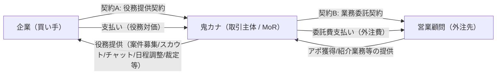
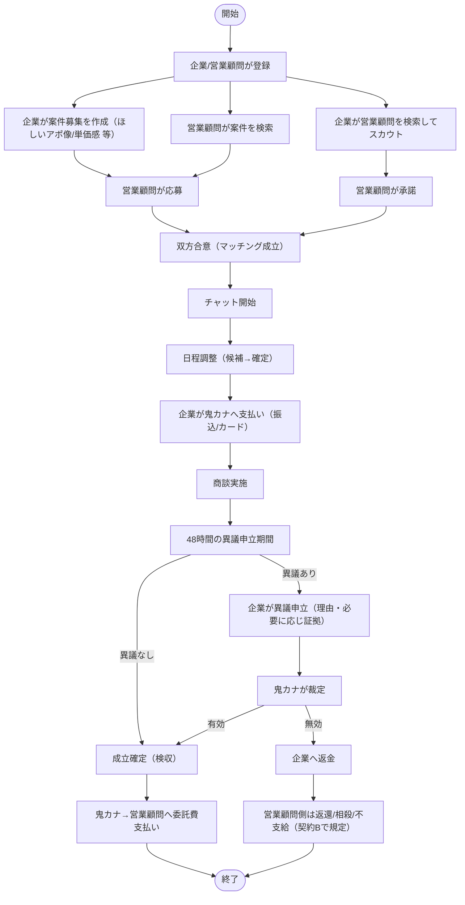
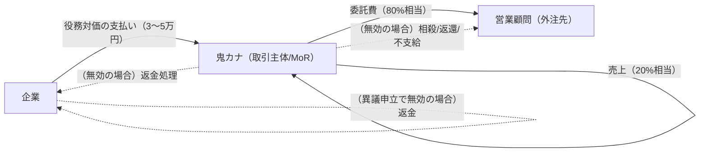

## スライド1：タイトル

**鬼カナが取引主体として開始する場合の業務フロー案（法務観点）**

---

## スライド2：免責事項

- これは**法的助言ではなく**、論点整理・フロー設計案です。
- 最終判断は**弁護士・税理士のレビュー**を前提に進めてください。

---

## スライド3：前提（0.1 事業の前提）

- **アポが欲しい企業**と**営業顧問（営業代行）**を繋げる会社/サービス
- **鬼カナ以外の営業顧問**と**アポが欲しい企業**も繋げるアプリ（マーケットプレイス型）

---

## スライド4：前提（0.2 現状の課題）

- 企業側と営業顧問側の**日程調整**等の業務負担が大きい
- その負担を**システムで効率化**したい

---

## スライド5：前提（0.3 主要機能）

- **企業側**
  - **案件の募集**（ほしいアポのイメージ、単価感など）
  - **スカウト**（営業顧問にオファー/招待）
  - **チャット**
  - **日程調整**
- **営業顧問側**
  - **案件を探せる**（検索/応募）

補足：
- 以降のフローはこの前提（案件募集⇄応募、スカウト⇄承諾、チャット、日程調整）に合わせています。
- 決済や48時間ルールは「B案（取引主体化）」の法務整理のために併記します（必須かどうかは運用で選択可能）。

---

## スライド6：取引主体化の狙い（1）

**狙い**：
- 「企業→営業顧問」間の送金（資金移動）をプラットフォームが単に中継しているのではなく、
  **プラットフォーム自身が責任を持って取引している**と評価される形に寄せる。

見え方（関係者の視点）：
- **企業側**：企業は「鬼カナから役務提供を受け、その対価を鬼カナに支払う」
- **顧問側**：顧問は「鬼カナに業務を提供し、鬼カナから委託費を受け取る」

---

## スライド7：取引主体化で狙う効果（1）

狙う効果：
1. 「第三者間の資金移動を引き受ける（資金移動業・為替取引）」と評価される**法的リスクの低減**
2. 代わりに「**自社売上**」と「**自社の外注費（委託費）**」の構造に寄せる

注意：
- “名目だけ”取引主体化して、実態が「右から左へ通過させているだけ」だとリスクが残る
- 重要なのは**実体（責任・裁量・返品対応・品質管理）**を持たせること

---

## スライド8：当事者（2.1）

- **企業（買い手）**：アポ/商談機会の提供を受ける側
- **鬼カナ（プラットフォーム）**：取引主体（役務提供者 / MoR）
- **営業顧問（営業代行/協力者/外注先）**：鬼カナに対して「アポ獲得業務」等を提供

---

## スライド9：契約構造（二段構え）（2.2）

「企業と営業顧問が直接契約する」のではなく、間に鬼カナが入る形。

- **契約A（役務提供契約）**：企業 ⇄ 鬼カナ
  - 企業は鬼カナへ対価を支払う
- **契約B（業務委託契約）**：鬼カナ ⇄ 営業顧問
  - 鬼カナは営業顧問へ委託費を支払う

（図のソース：`mermaid/01-contract-structure.mmd`）



---

## スライド10：契約A（企業向け）で押さえる点（2.3）

- 役務の内容（例：顧客紹介、商談日時の確定支援、紛争処理）
- 料金体系（例：1アポ 3〜5万円など）
- 48時間ルール（異議申立期間と返金条件）
- 免責・禁止事項・個人情報取り扱い
- （必要に応じ）録画/証拠提出への同意・手続

---

## スライド11：契約B（顧問向け）で押さえる点（2.3）

- 業務内容（情報の正確性、連絡・日程確定の協力、虚偽禁止等）
- 報酬条件（委託費＝売上の80%相当、成立条件・減額条件）
- 検収基準（いつ成立とみなすか）
- 反社/コンプライアンス、守秘義務、個人情報
- 返金発生時の取り扱い（相殺・返還・次回控除等）

---

## スライド12：業務フロー全体（3）

「案件募集⇄応募」「スカウト⇄承諾」の2ルートを含め、48時間ルール（異議申立）を組み込んだ全体像。

（図のソース：`mermaid/02-end-to-end-flow.mmd`）



---

## スライド13：標準フロー（3.1：異議なし）

1. **マッチング成立（入口2パターン）**
   - ルートA：案件募集 → 応募 → 選定合意
   - ルートB：スカウト → 承諾
2. **チャットですり合わせ**（ほしいアポ像、単価感、NG条件など）
3. **日程調整（候補→確定）**（会議URLの責任分界は運用で固定）
4. **企業が鬼カナへ支払い**（振込/カード）
5. **商談実施**
6. **48h待機**（異議なければ成立）
7. **成立確定（検収）**
8. **鬼カナ→顧問へ委託費支払い**（都度/締め支払い）

---

## スライド14：例外フロー（3.2：異議申立→返金）

1. **48h以内に企業が異議申立**
   - 理由（不出席、著しい短時間、虚偽説明 等）
   - 必要に応じ証拠提出（規約で定義）
2. **鬼カナが裁定**
   - 有効：成立→委託費支払
   - 無効：返金へ
3. **返金/精算**
   - 対企業：鬼カナが返金
   - 対顧問：不支給、または返還/相殺（契約Bに基づく）

---

## スライド15：取消・キャンセル（3.3）

UIと規約で必ず一致させる。

- **日時確定前**：原則、無料キャンセル
- **日時確定後〜実施前**：
  - 企業都合キャンセル：返金不可または一部返金
  - 顧問都合キャンセル：全額返金（＋再調整）

---

## スライド16：利用イメージ（企業側）（4.1）

1. アカウント作成（会社情報、契約A同意）
2. マッチング
   - 案件募集で応募を集める／顧問を探してスカウト
3. 日程調整・支払い
   - チャット→日程確定→鬼カナへ支払い
4. 商談・検収
   - 問題があれば48h以内に異議申立（なければ自動完了）

---

## スライド17：利用イメージ（営業顧問側）（4.2）

1. アカウント作成（事業者情報、振込口座、契約B同意）
2. マッチング
   - 案件を検索して応募／企業からのスカウトを承諾
3. 日程調整・実施
   - チャットで日程確定に協力→商談実施
4. 報酬受取
   - 48h経過で確定→支払サイクルに従い委託費受領

---

## スライド18：お金の流れ（4.3）

ポイント：企業の支払いは「顧問への送金」ではなく、**鬼カナの役務対価**として受領。
顧問への支払いは、鬼カナの**外注費（委託費）**として支払。

（図のソース：`mermaid/04-money-flow.mmd`）



---

## スライド19：なぜ“取引主体化”が必要か（5.1）

- 企業のお金をプラットフォームが受け取り、後で別人（営業顧問）へ渡すモデルは、
  事実関係によっては「第三者間の資金移動を引き受ける」と評価されるリスクがある。
- この評価は「カードか振込か」ではなく、**実質的に他人の資金移動を仲介しているか**で問題化し得る。

---

## スライド20：B案の法務ロジック（5.2）

B案での整理：
1. **企業の支払い**＝「顧問への送金」ではなく、**鬼カナのサービス対価**
2. **顧問への支払い**＝「預かり金の分配」ではなく、**鬼カナの外注費**

成立させるために鬼カナが担うべき役割：
- 価格・条件の決定/統制
- 返金・トラブル対応の一次責任
- 品質管理（不正排除、エスカレーション、証跡）
- 特商法の表示（販売者としての表示責任）

---

## スライド21：最低限作るべき条項（6）

### 契約A（企業向け）
- 役務の定義、有効アポの定義
- 48h異議申立（期限、手続、証拠）
- 返金ポリシー（全額/一部/返金不可）
- 禁止事項（直取引、虚偽、ハラスメント等）

### 契約B（顧問向け）
- 委託業務内容、誠実義務
- 報酬/検収（いつ発生するか）
- 返金時精算（不支給/相殺/返還）
- 反社排除、守秘

---

## スライド22：次に決定すべき事項（To Do）（7）

1. **決済手段**：振込のみ／カードも導入
2. **入金タイミング**：日程確定時（前払い）／実施後（後払い）
3. **顧問への支払サイクル**：確定後すぐ／月末締め等

専門家への相談ポイント：
- 資金移動業等の該当性リスク（契約・実体でどこまで下げられるか）
- 税務（売上計上、源泉、インボイス等）
- 特商法（表記/返金条件の書き方）

---

## スライド23：全体図（参考）

（図のソース：`mermaid/00-overall-structure.mmd`）

```mermaid
flowchart LR
  %% --- Actors ---
  C[企業]:::actor
  O[鬼カナ（取引主体 / MoR）]:::actor
  A[営業顧問（営業代行/外注先）]:::actor

  classDef actor fill:#f6f6f6,stroke:#333,stroke-width:1px;
  classDef step fill:#e8f0ff,stroke:#2b5fd9,stroke-width:1px;
  classDef decision fill:#fff3cd,stroke:#b08900,stroke-width:1px;
  classDef outcome fill:#e9f7ef,stroke:#1e7e34,stroke-width:1px;
  classDef risk fill:#fdecea,stroke:#b71c1c,stroke-width:1px;

  subgraph S1[① 契約/当事者構造（B案：取引主体化）]
    direction LR
    C -->|契約A: 役務提供契約| O
    O -->|役務提供（案件募集/スカウト/チャット/日程調整/裁定等）| C
    O -->|契約B: 業務委託契約| A
    A -->|アポ獲得/営業活動の提供| O
  end

  subgraph S2[② アプリ利用フロー（案件募集⇄応募 / スカウト⇄承諾）]
    direction LR
    REG[登録（企業/顧問）]:::step
    ENTRY{マッチングの入口}:::decision
    JP[企業：案件募集作成\n(ほしいアポ像/単価感/条件)]:::step
    AS[顧問：案件検索]:::step
    AP[顧問：応募]:::step
    SC[企業：顧問検索→スカウト]:::step
    AC[顧問：承諾/辞退]:::step
    MATCH[双方合意（マッチング成立）]:::outcome
    CHAT[チャット（要件すり合わせ）]:::step
    SCHED[日程調整（候補→確定）]:::step
    PAY_IN[企業→鬼カナ 支払い\n(振込/カード)]:::step
    MEET[商談実施]:::step
    WAIT[48h 異議申立期間]:::decision
    OK[成立確定（検収）]:::outcome
    DISPUTE[異議申立→裁定]:::risk
    REFUND[企業へ返金]:::risk

    REG --> ENTRY
    ENTRY -->|案件募集→応募| JP
    JP --> AS --> AP --> MATCH
    ENTRY -->|スカウト→承諾| SC --> AC
    AC -->|承諾| MATCH
    AC -->|辞退| ENTRY
    MATCH --> CHAT --> SCHED --> PAY_IN --> MEET --> WAIT
    WAIT -->|異議なし| OK
    WAIT -->|異議あり| DISPUTE
    DISPUTE -->|無効| REFUND
    DISPUTE -->|有効| OK
  end

  subgraph S3[③ お金の流れ（80/20・返金・精算）]
    direction LR
    M1[企業が支払う金額\n= 役務対価（例: 3〜5万円）]:::step
    M2[鬼カナ売上（20%相当）]:::outcome
    M3[顧問委託費（80%相当）]:::outcome
    M4[返金（無効時）]:::risk
    M5[顧問側：相殺/返還/不支給\n（契約Bに基づく）]:::risk

    M1 --> M2
    M1 --> M3
    M4 --> M5
  end

  C -.-> REG
  A -.-> REG
  C -.-> JP
  C -.-> SC
  A -.-> AS
  C -.-> PAY_IN

  C ==>|支払い（役務対価）| O
  O ==>|委託費支払い（外注費）| A
  REFUND -.->|返金処理| C
  REFUND -.->|（必要に応じ）精算| A
```
