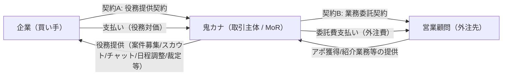
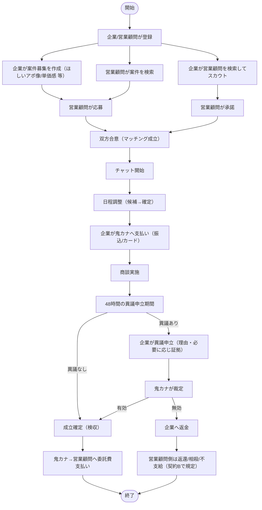
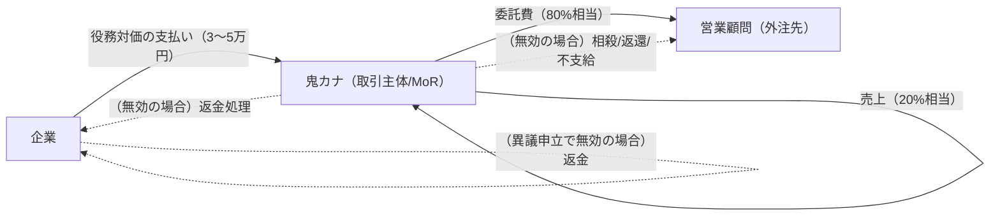
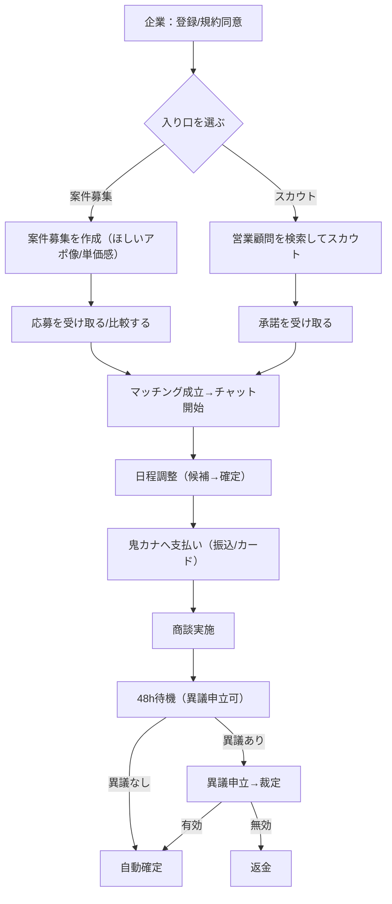
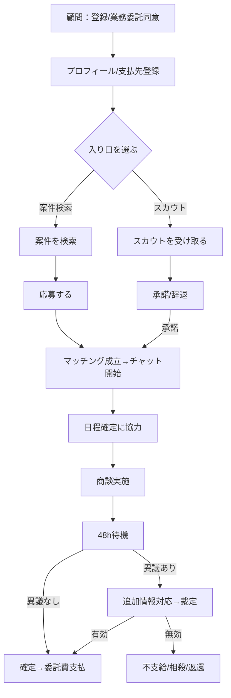

# B案：鬼カナが取引主体（Merchant of Record）として開始する場合の業務フロー案（法務観点）

> これは法的助言ではなく、論点整理・フロー設計案です。最終判断は弁護士・税理士レビュー前提で進めてください。

## 0. 前提（営業代行マッチングアプリとしての仕様前提）

### 0.1 事業の前提
- **アポが欲しい企業**と**営業顧問（営業代行）**を繋げる会社/サービス
- **鬼カナ以外の営業顧問**と**アポが欲しい企業**も繋げるアプリが望ましい（マーケットプレイス型）

### 0.2 現状の課題（効率化したい業務）
- 企業側と営業顧問側の**日程調整**等の業務が大変になっているため、そこを効率化したい

### 0.3 想定する主要機能（最低限）
- **企業側**
  - **案件の募集**ができる（「ほしいアポのイメージ」「単価感」等を掲載）
  - **スカウト**できる（営業顧問にオファー/招待）
  - **チャット**
  - **日程調整**
- **営業顧問側**
  - **案件を探せる**（検索/応募）

> 以降のフロー/図はこの前提（案件募集⇄応募、スカウト⇄承諾、チャット、日程調整）に合わせて表現しています。
> 決済や48hルールは「B案（取引主体化）」の法務整理のために併記します（必須かどうかは運用で選択可能）。


## 1. B案（取引主体化）の狙い

**狙い**は「企業→営業顧問」間の送金（資金移動）をプラットフォームが引き受けている、と評価されにくい形に寄せることです。

- **企業側から見ると**：企業は“鬼カナから役務提供を受け、その対価を鬼カナに支払う”
- **営業顧問側から見ると**：営業顧問は“鬼カナに対して業務（紹介/日程確定のための手続等）を提供し、鬼カナから委託費を受け取る”

この構造に寄せることで、
- 「第三者間の資金移動を引き受ける（為替取引）」という評価を避けやすくし
- 代わりに「自社売上」と「自社の外注費（委託費）」の枠に寄せます

※ただし、“名目だけ”取引主体化して、実態が「通過させているだけ」だと危険なので、**実体（責任・裁量・返品対応・品質管理）**が重要です。


## 2. 当事者と契約関係（イメージ）

### 2.1 登場人物
- **企業（買い手）**：アポ/商談機会の提供を受ける側
- **鬼カナ（プラットフォーム）**：取引主体（役務提供者）
- **営業顧問（営業代行/協力者/外注先）**：鬼カナに対して「アポ獲得業務」等を提供

### 2.2 契約の二段構え

```
(契約A) 企業  ──(役務提供契約)──>  鬼カナ
         <──(対価の支払い)──────

(契約B) 鬼カナ ──(業務委託契約)──> 営業顧問
         <──(委託費の支払い)──────
```

### 2.3 図（Mermaid形式）

> Markdownプレビューで図として表示できる形式です（Mermaid対応環境の場合）。



- **契約A（企業向け規約/個別契約）**で、
  - 役務の内容（例：顧客紹介、商談日時の確定支援、紛争処理）
  - 料金（3〜5万円等）
  - 48時間ルール（異議申立と返金条件）
  - 免責・禁止事項・個人情報取り扱い
  - （必要なら）録画/証拠提出の同意・手続
  を明確化します。

- **契約B（営業顧問向け業務委託契約）**で、
  - 業務内容（紹介情報の正確性、連絡・日程確定の協力、虚偽禁止等）
  - 報酬（例：委託費＝80%相当、ただし成立条件・減額/不支給条件）
  - 検収（いつ成立とみなすか）
  - 反社/コンプラ、守秘、個人情報
  - 返金が発生した場合の取り扱い（相殺・返還・次回控除等）
  を定めます。


## 3. 業務フロー（決済手段は「カードでも振込でも可」）

ここでは、前提にある **「案件募集⇄応募」** と **「スカウト⇄承諾」** の2ルートを含めた上で、（あなたの資料で出ていた）「48時間ルール」を前提に、**取引主体＝鬼カナ**での標準フローを文章フローチャート化します。

### 3.0 図（Mermaid形式：標準/異議申立）



## 3.4 利用イメージ（企業側 / 顧問側）＋3者の関与とお金の流れ

> ここは「画面/操作のイメージ」と「関与者・金銭の向き」を揃えるための章です。
> 実装形は自由ですが、契約・規約の整合を取りやすい“典型フロー”に寄せています。

### 3.4.1 システム登録時（企業側の利用イメージ：テキスト）

1. **企業がアカウント作成**
   - 会社情報（会社名、担当者、請求先）を登録
   - 規約（契約A）に同意（返金条件/48hルール含む）
2. **支払い手段の登録（任意）**
   - 銀行振込運用なら不要（請求書払い）
   - カード決済を使うなら企業は「カード入力」だけ（会員登録やKYCのようなオンボーディングは通常不要）
3. **利用開始**
   - **案件募集の作成**（ほしいアポ像/単価感 等）
   - **営業顧問の閲覧/検索→スカウト**
   - 応募/スカウト承諾後は **チャット→日程調整** へ

### 3.4.2 システム登録時（営業顧問側の利用イメージ：テキスト）

1. **営業顧問がアカウント作成**
   - 事業者情報（個人/法人、連絡先、振込口座）を登録（※鬼カナが支払うため、最低限の支払先情報は必要）
   - 業務委託契約（契約B）に同意（成立条件/返金時の相殺・返還等を含む）
2. **プロフィール/得意領域の登録**
   - 対象業種/エリア、得意領域、アポ獲得方法など
3. **案件検索/応募が可能に**
   - 企業の案件募集を検索して応募
   - 企業からのスカウトに対応

### 3.4.3 マッチング→日程調整→支払い（企業側の利用イメージ：テキスト）

1. **企業が案件募集を作成**（ほしいアポ像/単価感/条件等）
2. **営業顧問から応募が来る** or **企業が営業顧問をスカウト**
3. **双方合意でマッチング成立**（ここからチャットが開く）
4. **チャットで要件すり合わせ**
5. **日程調整（候補日提示→確定）**
6. **支払い（鬼カナへの支払い）**
   - 「日時確定時に前払い」か「実施後に請求」かは運用で選択（前払いの方が未払いリスクは低い）
7. **商談実施**
8. **48hルール**
   - 異議なし→自動確定
   - 異議あり→鬼カナ裁定→返金/確定

### 3.4.4 マッチング→日程調整→支払い（営業顧問側の利用イメージ：テキスト）

1. **案件を検索して応募** or **企業からのスカウトに承諾**
2. **双方合意でマッチング成立**（ここからチャットが開く）
3. **チャットで要件すり合わせ**
4. **日程調整の確定に協力**
5. **商談後の48hを待つ**
6. **確定後に委託費が計上・支払（都度 or 月次）**
   - 無効/返金の場合は、契約Bに従い「不支給」「相殺」「返還」など

### 3.4.5 図（Mermaid：3者の“関与”を含むシーケンス図）

```mermaid
sequenceDiagram
  autonumber
  participant C as 企業
  participant O as 鬼カナ（取引主体/MoR）
  participant A as 営業顧問（営業代行/外注先）

  rect rgb(240,240,240)
  note over C,O: システム登録時（契約A）
  C->>O: アカウント作成/会社情報登録\n規約同意（48h/返金等）
  O-->>C: 利用開始（案件募集/スカウト/チャット/日程調整）
  end

  rect rgb(240,240,240)
  note over A,O: システム登録時（契約B）
  A->>O: アカウント作成/支払先情報登録\n業務委託同意（成立条件/相殺等）
  O-->>A: 案件検索/応募・スカウト対応が可能に
  end

  alt ルートA：案件募集→応募
    C->>O: 案件募集を作成（ほしいアポ像/単価感 等）
    A->>O: 案件を検索して応募
    O->>C: 応募通知
    C->>O: オファー/合意（マッチング成立）
    O-->>A: マッチング成立通知（チャット開始）
  else ルートB：スカウト→承諾
    C->>O: 営業顧問を検索してスカウト
    O->>A: スカウト通知
    A-->>O: 承諾
    O-->>C: マッチング成立（チャット開始）
  end

  note over C,A: チャット（要件すり合わせ）
  C->>A: チャット送信
  A-->>C: チャット返信

  C->>O: 日程候補提示
  O->>A: 候補共有
  A-->>O: 確定可能日時を回答
  O-->>C: 日程確定

  C->>O: 支払い（鬼カナへ）
  O-->>C: 決済受付/入金確認

  note over C,O,A: 商談実施（顧問は同席しない想定も可）
  C-->>O: （必要に応じ）実施結果/異議申立

  alt 異議なし（48h経過）
    O-->>C: 成立確定
    O-->>A: 委託費支払（80%相当）\n※支払タイミングは都度/締め支払い
  else 異議あり
    C->>O: 異議申立（理由/必要に応じ証拠）
    O->>C: 追加情報要求（必要時）
    O->>A: 追加情報要求（必要時）
    O-->>C: 裁定（有効/無効）
    alt 無効
      O-->>C: 返金
      O-->>A: （契約Bに基づき）相殺/返還/不支給
    else 有効
      O-->>A: 委託費支払
    end
  end
```

### 3.4.6 図（Mermaid：お金の流れ／3者の関与）



### 3.4.7 図（Mermaid：企業側の利用フロー）



### 3.4.8 図（Mermaid：顧問側の利用フロー）



## 8. 付録：Mermaidコード一式（コピー用）

### 8.1 契約関係（2.3）


### 8.2 全体フロー（3.0）


### 8.3 3者の関与（3.4.5）

```mermaid
sequenceDiagram
  autonumber
  participant C as 企業
  participant O as 鬼カナ（取引主体/MoR）
  participant A as 営業顧問（営業代行/外注先）

  rect rgb(240,240,240)
  note over C,O: システム登録時（契約A）
  C->>O: アカウント作成/会社情報登録\n規約同意（48h/返金等）
  O-->>C: 利用開始（案件募集/スカウト/チャット/日程調整）
  end

  rect rgb(240,240,240)
  note over A,O: システム登録時（契約B）
  A->>O: アカウント作成/支払先情報登録\n業務委託同意（成立条件/相殺等）
  O-->>A: 案件検索/応募・スカウト対応が可能に
  end

  alt ルートA：案件募集→応募
    C->>O: 案件募集を作成（ほしいアポ像/単価感 等）
    A->>O: 案件を検索して応募
    O->>C: 応募通知
    C->>O: オファー/合意（マッチング成立）
    O-->>A: マッチング成立通知（チャット開始）
  else ルートB：スカウト→承諾
    C->>O: 営業顧問を検索してスカウト
    O->>A: スカウト通知
    A-->>O: 承諾
    O-->>C: マッチング成立（チャット開始）
  end

  note over C,A: チャット（要件すり合わせ）
  C->>A: チャット送信
  A-->>C: チャット返信

  C->>O: 日程候補提示
  O->>A: 候補共有
  A-->>O: 確定可能日時を回答
  O-->>C: 日程確定

  C->>O: 支払い（鬼カナへ）
  O-->>C: 決済受付/入金確認

  note over C,O,A: 商談実施（顧問は同席しない想定も可）
  C-->>O: （必要に応じ）実施結果/異議申立

  alt 異議なし（48h経過）
    O-->>C: 成立確定
    O-->>A: 委託費支払（80%相当）\n※支払タイミングは都度/締め支払い
  else 異議あり
    C->>O: 異議申立（理由/必要に応じ証拠）
    O->>C: 追加情報要求（必要時）
    O->>A: 追加情報要求（必要時）
    O-->>C: 裁定（有効/無効）
    alt 無効
      O-->>C: 返金
      O-->>A: （契約Bに基づき）相殺/返還/不支給
    else 有効
      O-->>A: 委託費支払
    end
  end
```

### 8.4 お金の流れ（3.4.6）


### 8.5 企業側フロー（3.4.7）


### 8.6 顧問側フロー（3.4.8）


### 3.1 標準フロー（異議なしで確定するケース）

1. **マッチングの成立（入口は2つ）**
   - 入口A：企業が**案件募集**を作成 → 営業顧問が**応募** → 企業が選定して合意
   - 入口B：企業が営業顧問を**スカウト** → 営業顧問が承諾

2. **チャットで要件すり合わせ**
   - ほしいアポ像、単価感、対象業界/地域、NG条件など

3. **日程調整（候補→確定）**
   - 商談はオンライン前提（Zoom/Meet等）
   - 会議URLや招待の責任分界（企業が用意/鬼カナが手配/顧問が用意）は運用で固定

4. **企業が鬼カナへ支払い**（決済手段は選択）
   - A) **銀行振込**：請求書→入金確認
   - B) **カード決済**：鬼カナが通常のカード決済（MoRとしての入金）

5. **商談実施**

6. **48時間の異議申立期間**
   - 企業が異議申立をしなければ「成立」扱い

7. **成立確定（検収）**

8. **鬼カナ→営業顧問へ委託費支払い**
   - 原則：成立確定後に支払指図（例：翌営業日〜月次）
   - 20%は鬼カナの手数料（売上/役務対価）


### 3.2 例外フロー（異議申立→返金になるケース）

マッチング成立〜商談実施までは同じ（上記の標準フロー参照）

1. **企業が48時間以内に異議申立**
   - 申立理由を定型化（例：不出席、著しい短時間、虚偽説明 等）
   - 証拠提出の要否（「原則当事者保管、必要時に提示」等、保管主体を決める）

2. **鬼カナが裁定**
   - 有効：成立確定→委託費支払
   - 無効：企業に返金

3. **無効（返金）時の営業顧問側の扱い（契約Bで規定）**
   - 既に支払済みなら：返還 or 相殺 or 次回控除
   - 未払いなら：不支給（または減額）


### 3.3 取消・キャンセル（日時確定前/後）

- **日時確定前**：無料取消（原則）
- **日時確定後〜実施前**：
  - 企業都合キャンセル（一定条件で返金不可/一部返金など）
  - 顧客都合キャンセル（返金/再調整など）

ここはトラブルが最も多いので、**「誰の都合か」「証明は何で」「返金はどうするか」**をUIと規約で一致させます。


## 4. なぜB案レベルの“取引主体化”が必要か（法的観点）

### 4.1 何が問題になり得るか：資金移動業（為替取引）の評価

企業のお金をプラットフォームが受け取り、後で別人（営業顧問）へ渡すモデルは、事実関係によっては「隔地者間の資金移動を引き受ける」形と評価され、**資金移動業（為替取引）**の論点が出ます。

この論点は「クレカか振込か」に関わらず、**“実質的に第三者間の資金移動を引き受けているか”**で見られます。

参考：金融庁の整理（収納代行や二重払いリスク等の観点）
- [金融庁 資金決済制度等に関するWG報告書（2025/1/22）](https://www.fsa.go.jp/singi/singi_kinyu/tosin/20250122/1.pdf?utm_source=openai)

### 4.2 B案で「資金移動」ではなく「役務提供＋外注費」に寄せる

B案は、以下を明確化して“構造”を変えます。

- **企業の支払いは「営業顧問への送金」ではなく**、
  **鬼カナから受ける役務（紹介/調整/紛争処理等）の対価**と位置付ける

- **営業顧問への支払いは「企業からの預かり金の分配」ではなく**、
  **鬼カナが自社事業として負担する外注費（業務委託費）**と位置付ける

この位置付けを“名目”ではなく“実体”にするため、鬼カナは取引主体として次を担う必要が出ます。

- **価格や提供条件の統制**（単価レンジ、成立条件）
- **返金・紛争の一次対応責任**（48h裁定、返金判断）
- **品質・不正の統制**（虚偽紹介の排除、アカ停止、証跡）
- **特商法表示等の対外説明責任**（通信販売としての表示）

特商法（通信販売）の表示義務は、オンラインで対価を取るなら基本論点になります。
- [東京都：特商法（通信販売）情報](https://www.shouhiseikatu.metro.tokyo.lg.jp/manabitai/shouhisha/171/01.html?utm_source=openai)

### 4.3 「B案にするだけで完全に安全」ではない理由

B案でも、次のように“通過”に見えるとリスクが残ります。

- 単価が常に「企業支払額＝営業顧問受取額＋20%」で固定され、
  鬼カナが役務提供者としての裁量や責任を実質持たない
- 返金判断が形式的（営業顧問・企業の間に入って“送金だけ”しているように見える）

したがって、B案は
- 契約（規約/業務委託）
- UI/運用（紛争処理、証拠、返金）
- 会計・税務（売上計上、源泉、インボイス等）

まで含めて“整合した一式”にする必要があります。


## 5. B案で最低限作るべき条項（たたき台）

### 5.1 企業向け規約（契約A）
- 役務の定義（紹介/調整/裁定）
- 成立条件（有効アポの定義）
- 48h異議申立（期限、手続、必要資料）
- 返金条件（全額/一部、返金不可条件）
- 録画・証拠の扱い（同意、提出要請、保管期間）
- 禁止事項（虚偽申告、嫌がらせ、反社）

### 5.2 営業顧問向け業務委託（契約B）
- 業務内容（紹介情報の正確性、連絡義務、虚偽禁止）
- 検収・成立条件（いつ委託費が発生するか）
- 返金時の精算（相殺・返還・不支給）
- 守秘・個人情報
- 反社条項


## 6. 重要な注意（次に専門家へ出すべき論点）

B案を採る場合、弁護士/税理士に最低限確認したい論点です。

- **資金移動業該当性**：B案の契約・実体でどこまでリスクを下げられるか
- **税務**：売上計上（総額/手数料）、消費税、源泉徴収の要否、インボイス
- **特商法**：表示義務の範囲、返金条件の書き方
- **個人情報/証拠**：録画・スクショの同意と保管（保持しない運用の可否）


## 7. 次に決めるとフローが確定する3点

1. **決済手段**：まずは銀行振込（請求書）で開始するか、カードも併用するか
2. **支払タイミング**：日時確定時に支払い（前払い）か、実施後請求（後払い）か
3. **委託費の支払いタイミング**：成立確定後に都度払いか、月次まとめ払いか

---

最終更新: 2025-12-16
